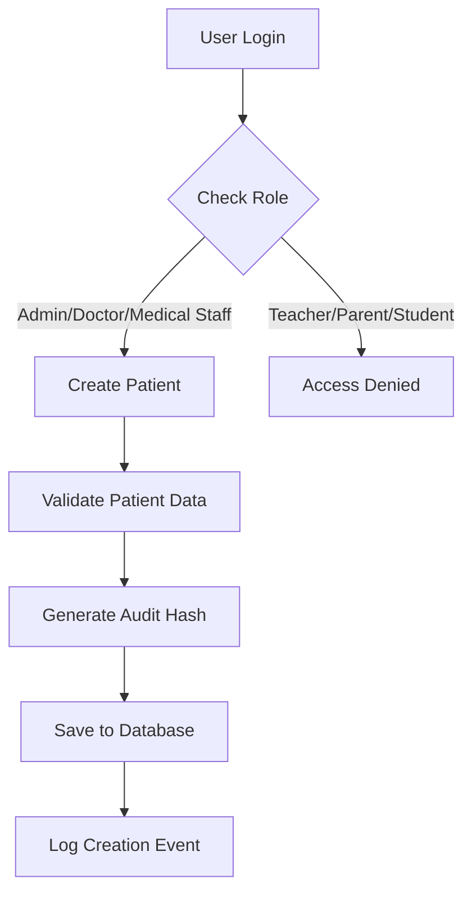
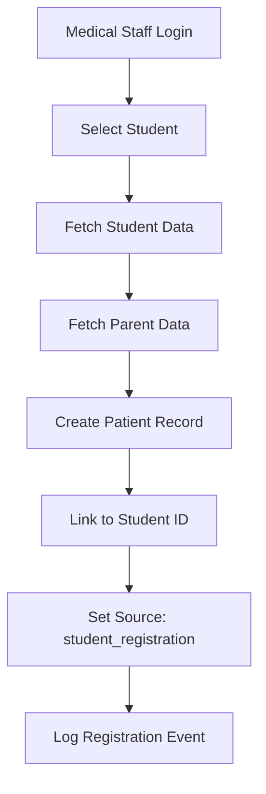
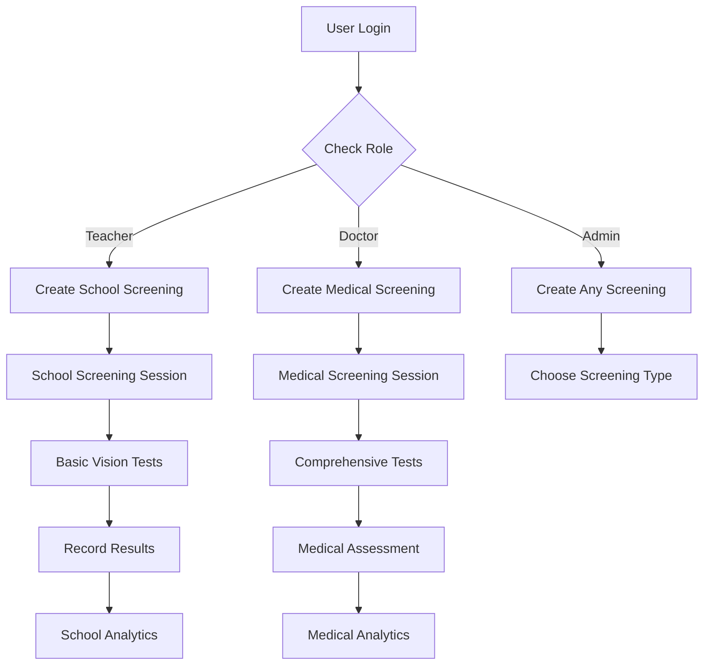

# 📚 **EVEP Platform - Permissions & Screening System Documentation**

## 📋 **Table of Contents**
1. [Overview](#overview)
2. [User Roles & Permissions](#user-roles--permissions)
3. [Patient Management System](#patient-management-system)
4. [Screening Management System](#screening-management-system)
5. [Student-to-Patient Registration](#student-to-patient-registration)
6. [API Endpoints Reference](#api-endpoints-reference)
7. [Security & Audit Features](#security--audit-features)
8. [Implementation Details](#implementation-details)
9. [Troubleshooting](#troubleshooting)

---

## 🎯 **Overview**

The EVEP (Eye Vision Education Platform) system implements a comprehensive role-based access control (RBAC) system that separates different types of users and their permissions based on their roles in the healthcare and education ecosystem.

### **Core Principles:**
- **Separation of Concerns**: School-based screening vs medical screening
- **Role-Based Access**: Different permissions for different user types
- **Data Privacy**: Users can only access data relevant to their role
- **Audit Trail**: All actions are logged for compliance and security

---

## 👥 **User Roles & Permissions**

### **1. Admin (`role: "admin"`)**
**Full system access with all permissions**
- ✅ Create, view, update, delete patients
- ✅ Create both school and medical screenings
- ✅ View all screening data and analytics
- ✅ Manage system settings and configurations
- ✅ Access all user management functions

### **2. Doctor (`role: "doctor"`)**
**Medical professional with patient care permissions**
- ✅ Create, view, update patients
- ✅ Create medical screenings only
- ✅ View medical screening data and analytics
- ✅ Access patient medical records
- ✅ Register students as patients

### **3. Medical Staff (`role: "medical_staff"`)**
**Healthcare support staff**
- ✅ Create, view patients
- ✅ View patient records
- ✅ Register students as patients
- ❌ Cannot create screenings (reserved for doctors)

### **4. Teacher (`role: "teacher"`)**
**Educational staff for school-based screening**
- ❌ Cannot create patients directly
- ✅ Create school screenings only
- ✅ View school screening data and analytics
- ❌ Cannot access patient medical records

### **5. Parent (`role: "parent"`)**
**Patient guardians with limited access**
- ✅ View their own children's patient records
- ✅ View their children's screening results
- ❌ Cannot create patients or screenings
- ❌ Cannot access other patients' data

### **6. Student (`role: "student"`)**
**Minimal access for educational purposes**
- ❌ Cannot create patients or screenings
- ❌ Cannot view patient records
- ✅ Limited access to educational content

---

## 🏥 **Patient Management System**

### **Patient Creation Flow**

#### **Direct Patient Creation**


#### **Student-to-Patient Registration**


### **Patient Data Model**
```json
{
  "patient_id": "ObjectId",
  "first_name": "string",
  "last_name": "string",
  "date_of_birth": "YYYY-MM-DD",
  "gender": "male|female|other",
  "parent_email": "email@example.com",
  "parent_phone": "phone_number",
  "emergency_contact": "string",
  "emergency_phone": "phone_number",
  "address": "string",
  "school": "string (optional)",
  "grade": "string (optional)",
  "medical_history": "object",
  "family_vision_history": "object",
  "insurance_info": "object",
  "consent_forms": "object",
  "is_active": "boolean",
  "created_at": "timestamp",
  "updated_at": "timestamp",
  "created_by": "user_id",
  "audit_hash": "string",
  "student_id": "ObjectId (optional)",
  "source": "direct|student_registration"
}
```

---

## 🔍 **Screening Management System**

### **Screening Categories**

#### **1. School Screening (`screening_category: "school_screening"`)**
- **Purpose**: Basic vision screening in educational settings
- **Conducted by**: Teachers
- **Equipment**: Basic screening tools (Snellen charts, color vision tests)
- **Scope**: Preliminary vision assessment
- **Follow-up**: Referral to medical professionals if issues detected

#### **2. Medical Screening (`screening_category: "medical_screening"`)**
- **Purpose**: Professional medical vision assessment
- **Conducted by**: Doctors
- **Equipment**: Advanced medical equipment
- **Scope**: Comprehensive vision evaluation
- **Follow-up**: Medical treatment and prescriptions

### **Screening Workflow**



### **Screening Data Model**
```json
{
  "session_id": "ObjectId",
  "patient_id": "ObjectId",
  "examiner_id": "ObjectId",
  "screening_type": "distance|near|color|comprehensive",
  "screening_category": "school_screening|medical_screening",
  "equipment_used": "string",
  "notes": "string",
  "status": "in_progress|completed|cancelled",
  "results": [
    {
      "eye": "left|right",
      "distance_acuity": "20/20",
      "near_acuity": "N8",
      "color_vision": "normal|deficient",
      "depth_perception": "normal|impaired",
      "contrast_sensitivity": "normal|reduced",
      "additional_tests": "object"
    }
  ],
  "conclusion": "string",
  "recommendations": "string",
  "follow_up_date": "YYYY-MM-DD",
  "created_at": "timestamp",
  "completed_at": "timestamp",
  "audit_hash": "string"
}
```

---

## 🎓 **Student-to-Patient Registration**

### **Process Overview**
When a student needs medical attention, they can be registered as a patient while maintaining the link to their original student record.

### **Registration Steps**
1. **Authentication**: Medical staff (doctor, medical_staff, admin) logs in
2. **Student Selection**: Choose student from EVEP system
3. **Data Retrieval**: Fetch student and parent information
4. **Patient Creation**: Create patient record with student data
5. **Linking**: Maintain reference to original student record
6. **Audit Logging**: Record the registration event

### **Data Mapping**
| Student Field | Patient Field | Source |
|---------------|---------------|---------|
| `first_name` | `first_name` | Student |
| `last_name` | `last_name` | Student |
| `birth_date` | `date_of_birth` | Student |
| `gender` | `gender` | Student |
| `address` | `address` | Student (formatted) |
| `school_name` | `school` | Student |
| `grade_level` | `grade` | Student |
| `email` | `parent_email` | Parent |
| `phone` | `parent_phone` | Parent |
| `emergency_contact` | `emergency_contact` | Input |
| `emergency_phone` | `emergency_phone` | Input |

---

## 🔌 **API Endpoints Reference**

### **Patient Management Endpoints**

#### **Create Patient**
```http
POST /api/v1/patients
Authorization: Bearer <token>
Content-Type: application/json

{
  "first_name": "string",
  "last_name": "string",
  "date_of_birth": "YYYY-MM-DD",
  "gender": "male|female|other",
  "parent_email": "email@example.com",
  "parent_phone": "phone_number",
  "emergency_contact": "string",
  "emergency_phone": "phone_number",
  "address": "string",
  "school": "string (optional)",
  "grade": "string (optional)"
}
```

**Permissions**: `doctor`, `medical_staff`, `admin`

#### **Get Patients**
```http
GET /api/v1/patients?skip=0&limit=100
Authorization: Bearer <token>
```

**Permissions**: `doctor`, `medical_staff`, `parent`, `admin`

#### **Register Student as Patient**
```http
POST /api/v1/patients/from-student/{student_id}
Authorization: Bearer <token>
Content-Type: application/json

{
  "emergency_contact": "string",
  "emergency_phone": "phone_number",
  "medical_history": "object (optional)",
  "family_vision_history": "object (optional)",
  "insurance_info": "object (optional)",
  "consent_forms": "object (optional)"
}
```

**Permissions**: `doctor`, `medical_staff`, `admin`

### **Screening Management Endpoints**

#### **Create Screening Session**
```http
POST /api/v1/screenings/sessions
Authorization: Bearer <token>
Content-Type: application/json

{
  "patient_id": "ObjectId",
  "examiner_id": "ObjectId",
  "screening_type": "distance|near|color|comprehensive",
  "screening_category": "school_screening|medical_screening",
  "equipment_used": "string (optional)",
  "notes": "string (optional)"
}
```

**Permissions**: 
- `teacher` → `school_screening` only
- `doctor` → `medical_screening` only
- `admin` → both categories

#### **Get Screening Sessions**
```http
GET /api/v1/screenings/sessions?patient_id=ObjectId&screening_category=school_screening
Authorization: Bearer <token>
```

**Permissions**: 
- `teacher` → `school_screening` only
- `doctor` → `medical_screening` only
- `admin` → both categories

#### **Get Patient Screening Analytics**
```http
GET /api/v1/screenings/analytics/patient/{patient_id}
Authorization: Bearer <token>
```

**Permissions**: 
- `teacher` → school screening analytics only
- `doctor` → medical screening analytics only
- `admin` → all analytics

---

## 🔒 **Security & Audit Features**

### **Authentication & Authorization**
- **JWT Tokens**: Secure token-based authentication
- **Role-Based Access Control**: Granular permissions per role
- **Token Expiration**: Automatic token refresh mechanism
- **Session Management**: Secure session handling

### **Audit Logging**
All system actions are logged with the following information:
```json
{
  "action": "patient_created|screening_session_created|student_registered_as_patient",
  "user_id": "ObjectId",
  "timestamp": "ISO 8601",
  "audit_hash": "blockchain_style_hash",
  "details": "object",
  "client_ip": "string",
  "user_agent": "string"
}
```

### **Audit Hash Generation**
```python
def generate_blockchain_hash(data: str) -> str:
    """Generate blockchain-style hash for audit trail"""
    combined = f"{data}:{settings.JWT_SECRET_KEY}:{datetime.utcnow().isoformat()}"
    return hashlib.sha256(combined.encode()).hexdigest()
```

### **Data Privacy**
- **Parent-Child Relationship**: Parents can only access their own children's data
- **Role-Based Filtering**: Users see only data relevant to their role
- **Screening Separation**: School and medical screenings are completely separate
- **Encrypted Storage**: Sensitive data is encrypted at rest

---

## ⚙️ **Implementation Details**

### **Backend Architecture**
```
backend/
├── app/
│   ├── api/
│   │   ├── patients.py          # Patient management endpoints
│   │   ├── screenings.py        # Screening management endpoints
│   │   └── auth.py              # Authentication endpoints
│   ├── core/
│   │   ├── security.py          # Security utilities
│   │   ├── database.py          # Database connection
│   │   └── config.py            # Configuration settings
│   └── models/
│       └── evep_models.py       # Data models
```

### **Database Collections**
- `patients`: Patient records
- `screenings`: Screening sessions
- `audit_logs`: System audit trail
- `users`: User accounts
- `admin_users`: Admin user accounts
- `evep.students`: Student records
- `evep.parents`: Parent records
- `evep.teachers`: Teacher records
- `evep.schools`: School records

### **Frontend Integration**
The frontend applications (Admin Panel and Medical Portal) implement role-based UI components that show/hide features based on user permissions.

---

## 🔧 **Troubleshooting**

### **Common Issues**

#### **1. Permission Denied Errors**
**Problem**: User receives 403 Forbidden error
**Solution**: Check user role and endpoint permissions

#### **2. Screening Category Mismatch**
**Problem**: Teacher trying to create medical screening
**Solution**: Ensure correct screening_category is set

#### **3. Parent Access Issues**
**Problem**: Parent cannot view child's records
**Solution**: Verify parent_email matches child's parent_email

#### **4. Student Registration Failures**
**Problem**: Cannot register student as patient
**Solution**: Check if student exists and user has proper permissions

### **Debug Commands**

#### **Check User Permissions**
```bash
curl -X GET http://localhost:8013/api/v1/auth/profile \
  -H "Authorization: Bearer <token>"
```

#### **Test Patient Creation**
```bash
curl -X POST http://localhost:8013/api/v1/patients \
  -H "Authorization: Bearer <token>" \
  -H "Content-Type: application/json" \
  -d '{"first_name": "Test", "last_name": "Patient", ...}'
```

#### **Test Screening Creation**
```bash
curl -X POST http://localhost:8013/api/v1/screenings/sessions \
  -H "Authorization: Bearer <token>" \
  -H "Content-Type: application/json" \
  -d '{"patient_id": "ObjectId", "screening_category": "school_screening", ...}'
```

### **Log Analysis**
Check audit logs for detailed action tracking:
```bash
# View recent audit logs
db.audit_logs.find().sort({timestamp: -1}).limit(10)
```

---

## 📞 **Support & Contact**

For technical support or questions about the EVEP platform:
- **Documentation**: This document and related guides
- **API Reference**: OpenAPI/Swagger documentation
- **Issue Tracking**: GitHub issues repository
- **Security**: Report security issues to security@evep.com

---

**Document Version**: 1.0  
**Last Updated**: January 2025  
**Maintained by**: EVEP Development Team
