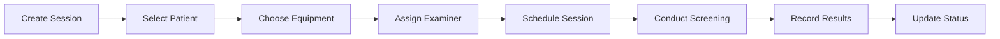
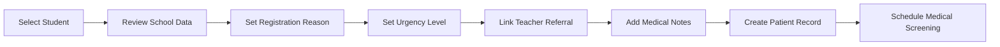
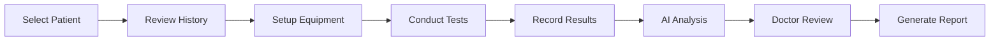
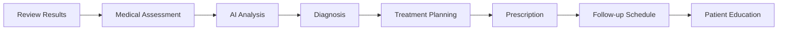
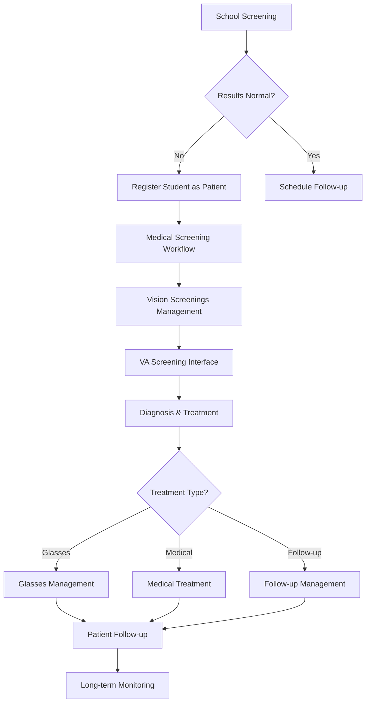

# EVEP Screening Component Comparison & Analysis

## 🔍 **Component Overview**

This document provides a detailed comparison of the different screening and patient management components in the EVEP system, explaining their distinct purposes, workflows, and use cases.

---

## 📊 **Component Comparison Matrix**

| **Component** | **Vision Screenings** | **Register Student as Patient** | **VA Screening Interface** | **Diagnosis & Treatment** |
|---------------|----------------------|----------------------------------|----------------------------|---------------------------|
| **Purpose** | Session Management | Student-to-Patient Conversion | Professional Screening | Medical Decision Making |
| **Primary User** | Medical Staff | Medical Staff | Doctors | Doctors |
| **Data Source** | Patients | EVEP Students | Patients | Screening Results |
| **Output** | Screening Sessions | Patient Records | Medical Results | Treatment Plans |
| **Complexity** | Medium | Low | High | High |
| **Medical Level** | Basic | Administrative | Professional | Expert |

---

## 🏫 **1. Vision Screenings (General Screening Management)**

### **Component Details**
- **File**: `frontend/src/pages/Screenings.tsx`
- **Route**: `/dashboard/screenings`
- **Purpose**: General screening session management and administration

### **Key Features**
```typescript
interface ScreeningSession {
  _id: string;
  patient_id: string;
  patient_name: string;
  examiner_id: string;
  examiner_name: string;
  screening_type: string;
  equipment_used: string;
  status: 'pending' | 'in_progress' | 'completed' | 'cancelled';
  created_at: string;
  updated_at: string;
  results?: ScreeningResults;
}
```

### **Workflow**


### **Use Cases**
- **Daily Screening Management**: Organize and track screening sessions
- **Equipment Management**: Record and track screening equipment usage
- **Staff Assignment**: Assign medical staff to screening sessions
- **Session Tracking**: Monitor session status and progress
- **Basic Results**: Record fundamental screening results

### **Access Control**
- **Medical Staff**: Full access to create and manage sessions
- **Doctors**: Can view and participate in sessions
- **Teachers**: View-only access to understand process
- **Admins**: Full administrative access

---

## 👨‍🎓 **2. Register Student as Patient (Student-to-Patient Conversion)**

### **Component Details**
- **File**: `frontend/src/components/StudentToPatientRegistration.tsx`
- **Route**: `/dashboard/medical-screening/patient-registration`
- **Purpose**: Convert EVEP students into medical patients

### **Key Features**
```typescript
interface StudentToPatientRegistrationProps {
  appointmentId?: string;
  onRegistrationComplete?: (registration: any) => void;
  onCancel?: () => void;
}

interface Student {
  _id: string;
  first_name: string;
  last_name: string;
  student_code: string;
  grade_level: string;
  school_name: string;
  parent_id: string;
}
```

### **Workflow**


### **Use Cases**
- **School Referrals**: Handle teacher referrals for medical evaluation
- **Data Migration**: Bridge school screening data to medical system
- **Patient Creation**: Automatically create patient records from student data
- **Referral Tracking**: Track the source and reason for medical referral
- **Urgency Assessment**: Set priority levels for medical attention

### **Access Control**
- **Medical Staff**: Full access to register students as patients
- **Doctors**: Can view and approve registrations
- **Teachers**: Can initiate referrals but not complete registration
- **Admins**: Full administrative access

---

## 👁️ **3. VA Screening Interface (Professional Medical Screening)**

### **Component Details**
- **File**: `frontend/src/components/VAScreeningInterface.tsx`
- **Route**: `/dashboard/medical-screening/va-screening`
- **Purpose**: Professional visual acuity screening for registered patients

### **Key Features**
```typescript
interface VAScreeningInterfaceProps {
  patientId?: string;
  appointmentId?: string;
  onScreeningComplete?: (screening: any) => void;
  onCancel?: () => void;
}

interface VAScreeningResult {
  eye: string;
  distance_acuity_uncorrected?: string;
  distance_acuity_corrected?: string;
  near_acuity_uncorrected?: string;
  near_acuity_corrected?: string;
  color_vision?: string;
  depth_perception?: string;
  contrast_sensitivity?: string;
  additional_tests?: any;
}
```

### **Workflow**


### **Use Cases**
- **Professional Assessment**: Comprehensive vision evaluation
- **Medical Documentation**: Detailed medical record creation
- **Treatment Planning**: Generate data for treatment decisions
- **Follow-up Planning**: Create baseline for future comparisons
- **Quality Assurance**: Ensure screening standards and accuracy

### **Access Control**
- **Doctors**: Full access to conduct professional screenings
- **Medical Staff**: Can assist and record basic results
- **Students**: No access (patients only)
- **Admins**: View-only access for oversight

---

## 🩺 **4. Diagnosis & Treatment (Medical Decision Making)**

### **Component Details**
- **File**: Currently placeholder (`<div>Diagnosis & Treatment</div>`)
- **Route**: `/dashboard/medical-screening/diagnosis`
- **Purpose**: Medical diagnosis and treatment planning

### **Intended Features**
```typescript
interface DiagnosisTreatmentProps {
  patientId: string;
  screeningResults: VAScreeningResult[];
  medicalHistory: MedicalHistory;
  onDiagnosisComplete?: (diagnosis: Diagnosis) => void;
}

interface Diagnosis {
  diagnosis_type: 'normal' | 'vision_correction' | 'medical_condition' | 'specialist_referral';
  treatment_plan: TreatmentPlan;
  follow_up_schedule: FollowUpSchedule;
  recommendations: string[];
  prescriptions?: Prescription[];
}
```

### **Workflow**


### **Use Cases**
- **Medical Diagnosis**: Professional medical diagnosis
- **Treatment Planning**: Create comprehensive treatment plans
- **Prescription Management**: Handle glasses and medication prescriptions
- **Follow-up Coordination**: Plan and schedule follow-up care
- **Patient Education**: Provide patient and parent education

### **Access Control**
- **Doctors**: Full access to diagnosis and treatment
- **Medical Staff**: Can view and assist with implementation
- **Patients/Parents**: View-only access to their own plans
- **Admins**: Administrative oversight access

---

## 🔄 **5. Complete Workflow Integration**

### **End-to-End Process Flow**


### **Data Flow Between Components**

```mermaid
graph LR
    A[Students Collection] --> B[StudentToPatientRegistration]
    B --> C[Patients Collection]
    C --> D[Vision Screenings]
    D --> E[VA Screening Interface]
    E --> F[Screening Results]
    F --> G[Diagnosis & Treatment]
    G --> H[Treatment Plans]
    H --> I[Follow-up Management]
```


---

## 📈 **6. Performance & Quality Metrics**

### **Component-Specific KPIs**

#### **Vision Screenings**
- **Session Completion Rate**: % of scheduled sessions completed
- **Equipment Utilization**: Equipment usage efficiency
- **Staff Productivity**: Sessions per staff member
- **Session Duration**: Average time per screening session

#### **Student-to-Patient Registration**
- **Conversion Rate**: % of school referrals converted to patients
- **Processing Time**: Time from referral to patient creation
- **Data Accuracy**: % of accurate student-to-patient conversions
- **Referral Quality**: % of referrals requiring medical attention

#### **VA Screening Interface**
- **Screening Accuracy**: Correlation with final diagnosis
- **Test Completion Rate**: % of comprehensive tests completed
- **Result Consistency**: Consistency across multiple screenings
- **Professional Standards**: Compliance with medical standards

#### **Diagnosis & Treatment**
- **Diagnosis Accuracy**: Correlation with treatment outcomes
- **Treatment Compliance**: % of patients following treatment plans
- **Follow-up Attendance**: % of follow-up appointments attended
- **Patient Satisfaction**: Patient and parent satisfaction scores

---

## 🎯 **7. Best Practices & Recommendations**

### **Component Usage Guidelines**

#### **When to Use Vision Screenings**
- ✅ Managing daily screening schedules
- ✅ Tracking equipment and staff assignments
- ✅ Basic screening session administration
- ✅ Overview of screening activities
- ❌ Professional medical evaluation
- ❌ Detailed patient assessment

#### **When to Use Register Student as Patient**
- ✅ Converting school screening referrals
- ✅ Creating patient records from student data
- ✅ Handling teacher referrals
- ✅ Setting medical priority levels
- ❌ Direct patient registration
- ❌ Professional medical screening

#### **When to Use VA Screening Interface**
- ✅ Professional vision assessment
- ✅ Comprehensive medical evaluation
- ✅ Detailed result documentation
- ✅ Treatment planning preparation
- ❌ Basic screening administration
- ❌ School-based screening

#### **When to Use Diagnosis & Treatment**
- ✅ Making medical diagnoses
- ✅ Creating treatment plans
- ✅ Prescribing glasses/treatments
- ✅ Planning follow-up care
- ❌ Basic screening activities
- ❌ Administrative tasks

---

## 🔧 **8. Technical Implementation Notes**

### **Component Dependencies**
```
Vision Screenings
├── Patients Collection
├── Staff Management
└── Equipment Tracking

Register Student as Patient
├── Students Collection
├── Teachers Collection
└── Patient Registration API

VA Screening Interface
├── Patients Collection
├── Screening Results
└── Medical Equipment

Diagnosis & Treatment
├── Screening Results
├── Medical History
├── Treatment Plans
└── Follow-up Management
```

### **Data Relationships**
- **Students** → **Patients** (one-to-one conversion)
- **Patients** → **Screenings** (one-to-many)
- **Screenings** → **Results** (one-to-one)
- **Results** → **Diagnosis** (one-to-one)
- **Diagnosis** → **Treatment** (one-to-many)

---

## 🚀 **9. Future Enhancements**

### **Planned Improvements**

#### **Vision Screenings**
- **AI-Powered Scheduling**: Intelligent session scheduling
- **Mobile Integration**: Mobile app for session management
- **Real-time Updates**: Live status updates and notifications
- **Advanced Analytics**: Predictive analytics for session planning

#### **Register Student as Patient**
- **Automated Conversion**: AI-powered student-to-patient conversion
- **Bulk Processing**: Handle multiple referrals simultaneously
- **Integration APIs**: Direct school system integration
- **Smart Prioritization**: AI-powered urgency assessment

#### **VA Screening Interface**
- **AI-Assisted Screening**: Automated vision assessment
- **Advanced Equipment**: Integration with modern screening equipment
- **Real-time Analysis**: Live result analysis and recommendations
- **Mobile Screening**: Portable screening capabilities

#### **Diagnosis & Treatment**
- **AI Diagnosis Support**: AI-powered diagnosis assistance
- **Treatment Prediction**: Predictive treatment outcomes
- **Telemedicine Integration**: Remote consultation capabilities
- **Advanced Analytics**: Comprehensive outcome analytics

---

## 📋 **10. Summary & Recommendations**

### **Key Takeaways**

1. **Clear Separation of Concerns**: Each component has a distinct purpose and scope
2. **Role-Based Access**: Proper access control based on user roles
3. **Workflow Integration**: Seamless data flow between components
4. **Scalability**: Modular design allows for future enhancements
5. **Quality Assurance**: Built-in quality metrics and monitoring

### **Implementation Recommendations**

1. **Start with Vision Screenings**: Use for basic session management
2. **Implement Student Conversion**: Handle school referrals efficiently
3. **Deploy VA Screening**: Provide professional medical evaluation
4. **Complete with Diagnosis**: Enable comprehensive treatment planning
5. **Monitor and Optimize**: Track KPIs and continuously improve

### **Success Metrics**

- **System Adoption**: % of users actively using each component
- **Workflow Efficiency**: Time reduction in screening processes
- **Data Quality**: Accuracy and completeness of medical records
- **User Satisfaction**: Satisfaction scores across all user types
- **Clinical Outcomes**: Improvement in vision health outcomes

---

**Document Version**: 1.0  
**Last Updated**: August 30, 2025  
**Status**: ✅ **COMPLETE**
