# EVEP System Architecture Diagrams

## 🏗️ **System Overview**

The EVEP (Eye Vision Enhancement Program) platform is a comprehensive healthcare management system designed to support school-based vision screening, hospital mobile unit operations, medical screening workflows, and glasses management.

## 📊 **1. High-Level System Architecture**


## 🔄 **2. Complete Workflow Architecture**


## 🗄️ **3. Database Schema Architecture**

```mermaid
erDiagram
    USERS {
        ObjectId _id PK
        string first_name
        string last_name
        string email
        string role
        string password_hash
        datetime created_at
        datetime updated_at
    }
    
    STUDENTS {
        ObjectId _id PK
        string first_name
        string last_name
        string student_code
        string grade_level
        ObjectId school_id FK
        ObjectId parent_id FK
        date birth_date
        string gender
        datetime created_at
        datetime updated_at
    }
    
    PARENTS {
        ObjectId _id PK
        string first_name
        string last_name
        string phone
        string email
        string address
        datetime created_at
        datetime updated_at
    }
    
    TEACHERS {
        ObjectId _id PK
        string first_name
        string last_name
        string position
        ObjectId school_id FK
        string phone
        string email
        datetime created_at
        datetime updated_at
    }
    
    SCHOOLS {
        ObjectId _id PK
        string name
        string address
        string phone
        string email
        datetime created_at
        datetime updated_at
    }
    
    PATIENTS {
        ObjectId _id PK
        string first_name
        string last_name
        date date_of_birth
        string gender
        string phone
        string email
        string address
        array medical_history
        array allergies
        datetime registration_date
        datetime created_at
        datetime updated_at
    }
    
    SCREENINGS {
        ObjectId _id PK
        ObjectId patient_id FK
        ObjectId examiner_id FK
        string screening_category
        string screening_type
        object results
        string overall_assessment
        array recommendations
        datetime screening_date
        datetime created_at
        datetime updated_at
    }
    
    VA_SCREENINGS {
        ObjectId _id PK
        ObjectId patient_id FK
        ObjectId appointment_id FK
        string screening_type
        array results
        string overall_assessment
        array recommendations
        string status
        datetime created_at
        datetime updated_at
    }
    
    DIAGNOSES {
        ObjectId _id PK
        ObjectId va_screening_id FK
        ObjectId patient_id FK
        string diagnosis_type
        string severity
        string diagnosis_details
        array treatment_recommendations
        object glasses_prescription
        ObjectId diagnosed_by FK
        datetime created_at
        datetime updated_at
    }
    
    TREATMENT_PLANS {
        ObjectId _id PK
        ObjectId diagnosis_id FK
        ObjectId patient_id FK
        string treatment_type
        string treatment_details
        date start_date
        string duration
        float cost_estimate
        string status
        ObjectId created_by FK
        datetime created_at
        datetime updated_at
    }
    
    APPOINTMENTS {
        ObjectId _id PK
        ObjectId school_id FK
        date appointment_date
        time start_time
        time end_time
        string screening_type
        int expected_students
        string status
        ObjectId created_by FK
        datetime created_at
        datetime updated_at
    }
    
    GLASSES_INVENTORY {
        ObjectId _id PK
        string item_code
        string item_name
        string category
        string brand
        string model
        object specifications
        float unit_price
        float cost_price
        int current_stock
        int reorder_level
        object supplier_info
        boolean is_active
        datetime created_at
        datetime updated_at
    }
    
    DELIVERIES {
        ObjectId _id PK
        ObjectId patient_id FK
        ObjectId glasses_order_id FK
        ObjectId school_id FK
        string delivery_address
        string contact_person
        string contact_phone
        date expected_delivery_date
        date actual_delivery_date
        string priority
        string status
        ObjectId created_by FK
        datetime created_at
        datetime updated_at
    }
    
    LINE_NOTIFICATIONS {
        ObjectId _id PK
        ObjectId patient_id FK
        ObjectId parent_id FK
        string notification_type
        string message
        string status
        datetime sent_at
        datetime created_at
    }
    
    CONSENT_REQUESTS {
        ObjectId _id PK
        ObjectId patient_id FK
        ObjectId parent_id FK
        string consent_type
        string status
        string response
        datetime requested_at
        datetime responded_at
        datetime created_at
    }
    
    AUDIT_LOGS {
        ObjectId _id PK
        ObjectId user_id FK
        string action
        string details
        string ip_address
        datetime created_at
    }
    
    STUDENT_PATIENT_MAPPING {
        ObjectId _id PK
        ObjectId student_id FK
        ObjectId patient_id FK
        ObjectId school_id FK
        date registration_date
        string status
        datetime created_at
        datetime updated_at
    }
    
    PATIENT_REGISTRATIONS {
        ObjectId _id PK
        ObjectId student_id FK
        ObjectId patient_id FK
        ObjectId appointment_id FK
        string registration_reason
        string urgency_level
        ObjectId referring_teacher_id FK
        string status
        ObjectId registered_by FK
        datetime created_at
        datetime updated_at
    }
    
    STOCK_ADJUSTMENTS {
        ObjectId _id PK
        ObjectId item_id FK
        string adjustment_type
        int quantity
        int previous_stock
        int new_stock
        string reason
        ObjectId adjusted_by FK
        datetime created_at
    }
    
    DELIVERY_CONFIRMATIONS {
        ObjectId _id PK
        ObjectId delivery_id FK
        string confirmation_type
        date confirmation_date
        string recipient_name
        string recipient_phone
        string signature
        ObjectId confirmed_by FK
        datetime created_at
    }
    
    USERS ||--o{ SCREENINGS : "examines"
    USERS ||--o{ VA_SCREENINGS : "conducts"
    USERS ||--o{ DIAGNOSES : "creates"
    USERS ||--o{ TREATMENT_PLANS : "creates"
    USERS ||--o{ APPOINTMENTS : "schedules"
    USERS ||--o{ DELIVERIES : "creates"
    USERS ||--o{ STOCK_ADJUSTMENTS : "adjusts"
    USERS ||--o{ DELIVERY_CONFIRMATIONS : "confirms"
    USERS ||--o{ AUDIT_LOGS : "generates"
    
    STUDENTS ||--o{ STUDENT_PATIENT_MAPPING : "mapped_to"
    PATIENTS ||--o{ STUDENT_PATIENT_MAPPING : "mapped_from"
    PATIENTS ||--o{ PATIENT_REGISTRATIONS : "registered"
    PATIENTS ||--o{ SCREENINGS : "screened"
    PATIENTS ||--o{ VA_SCREENINGS : "va_screened"
    PATIENTS ||--o{ DIAGNOSES : "diagnosed"
    PATIENTS ||--o{ TREATMENT_PLANS : "treated"
    PATIENTS ||--o{ DELIVERIES : "delivered_to"
    PATIENTS ||--o{ LINE_NOTIFICATIONS : "notified"
    PATIENTS ||--o{ CONSENT_REQUESTS : "consent_for"
    
    SCHOOLS ||--o{ STUDENTS : "enrolls"
    SCHOOLS ||--o{ TEACHERS : "employs"
    SCHOOLS ||--o{ APPOINTMENTS : "scheduled_for"
    SCHOOLS ||--o{ DELIVERIES : "delivered_to"
    
    PARENTS ||--o{ STUDENTS : "parent_of"
    PARENTS ||--o{ LINE_NOTIFICATIONS : "receives"
    PARENTS ||--o{ CONSENT_REQUESTS : "responds_to"
    
    TEACHERS ||--o{ PATIENT_REGISTRATIONS : "refers"
    
    VA_SCREENINGS ||--o{ DIAGNOSES : "leads_to"
    DIAGNOSES ||--o{ TREATMENT_PLANS : "requires"
    
    GLASSES_INVENTORY ||--o{ STOCK_ADJUSTMENTS : "adjusted"
    DELIVERIES ||--o{ DELIVERY_CONFIRMATIONS : "confirmed"
```



## 🔐 **4. Security & Authentication Architecture**


## 🚀 **5. Deployment Architecture**


## 📱 **6. User Interface Architecture**


## 🔄 **7. Data Flow Architecture**


## 📊 **8. API Architecture**

```mermaid
graph TB
    subgraph "Authentication APIs"
        AUTH_LOGIN[POST /auth/login]
        AUTH_REFRESH[POST /auth/refresh]
        AUTH_LOGOUT[POST /auth/logout]
    end
    
    subgraph "User Management APIs"
        USERS_CRUD[CRUD /users]
        ROLES[GET /roles]
        PERMISSIONS[GET /permissions]
    end
    
    subgraph "EVEP Management APIs"
        STUDENTS[CRUD /evep/students]
        PARENTS[CRUD /evep/parents]
        TEACHERS[CRUD /evep/teachers]
        SCHOOLS[CRUD /evep/schools]
        RELATIONSHIPS[GET /evep/relationships]
    end
    
    subgraph "Screening APIs"
        SCREENINGS[CRUD /screenings/sessions]
        OUTCOMES[CRUD /screenings/outcomes]
        VA_SCREENINGS[CRUD /screenings/va]
        DIAGNOSES[CRUD /diagnoses]
        TREATMENTS[CRUD /treatments/plans]
    end
    
    subgraph "Patient Management APIs"
        PATIENTS[CRUD /patients]
        PATIENT_REG[POST /patients/register-from-student]
        PATIENT_MAPPING[GET /patients/mappings]
    end
    
    subgraph "Appointment APIs"
        APPOINTMENTS[CRUD /appointments]
        SLOTS[GET /appointments/available-slots]
    end
    
    subgraph "LINE Integration APIs"
        LINE_SEND[POST /notifications/line/send]
        LINE_CONSENT[POST /notifications/line/send-consent]
        CONSENT_REQ[CRUD /consent/requests]
    end
    
    subgraph "Inventory APIs"
        INVENTORY[CRUD /inventory/glasses]
        STOCK_ADJUST[POST /inventory/glasses/{id}/adjust-stock]
        LOW_STOCK[GET /inventory/glasses/low-stock]
        INVENTORY_STATS[GET /inventory/glasses/stats]
    end
    
    subgraph "Delivery APIs"
        DELIVERIES[CRUD /deliveries]
        SCHOOL_DELIVERIES[GET /deliveries/school/{id}]
        UPCOMING[GET /deliveries/upcoming]
        DELIVERY_CONFIRM[POST /deliveries/{id}/confirm]
        DELIVERY_STATS[GET /deliveries/stats]
    end
    
    subgraph "Analytics APIs"
        AI_INSIGHTS[GET /ai/insights]
        SCREENING_STATS[GET /screenings/stats]
        PATIENT_STATS[GET /patients/stats]
    end
    
    subgraph "Security APIs"
        AUDIT_LOGS[GET /security/audit/logs]
        SECURITY_STATS[GET /security/stats]
    end
```

## 🎯 **9. System Integration Points**


## 📈 **10. Performance & Scalability Architecture**


---

## 📋 **System Summary**

### **Architecture Highlights:**
- **Microservices Architecture**: Modular design with separate services for different functionalities
- **RESTful API Design**: Clean, stateless API endpoints with proper HTTP methods
- **Database Design**: MongoDB with proper relationships and indexing
- **Security**: JWT authentication with role-based access control
- **Scalability**: Horizontal scaling capability with load balancing
- **Monitoring**: Comprehensive logging and performance monitoring

### **Technology Stack:**
- **Frontend**: React + TypeScript + Material-UI
- **Backend**: FastAPI + Python + MongoDB
- **Authentication**: JWT + RBAC
- **Containerization**: Docker + Docker Compose
- **Proxy**: Nginx
- **External APIs**: LINE Bot, SMS Gateway

### **Key Features:**
- **Complete Workflow Support**: All four phases of the EVEP program
- **Real-time Notifications**: LINE Bot integration for parent communication
- **Comprehensive Analytics**: Detailed reporting and statistics
- **Audit Trail**: Complete tracking of all system activities
- **Role-based Access**: Secure access control for different user types

---

**Status**: ✅ **COMPLETE** - All system architecture diagrams documented and ready for implementation review.

**Next**: Proceed to final system integration and testing phase.
