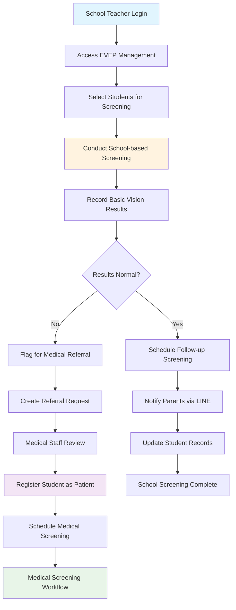
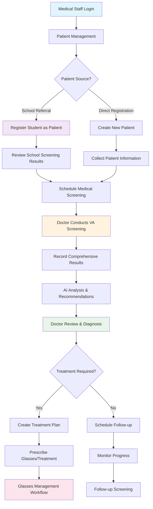
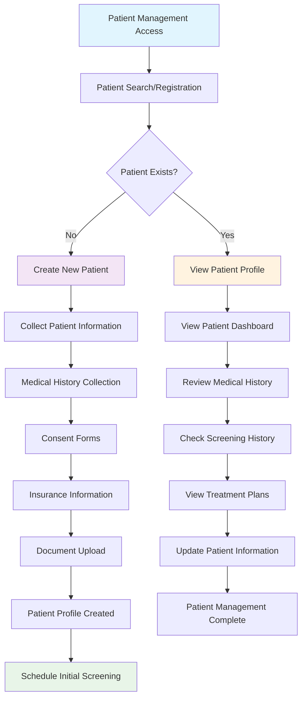
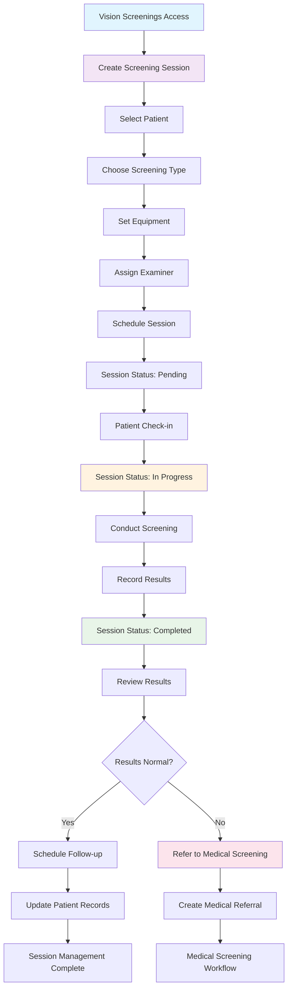
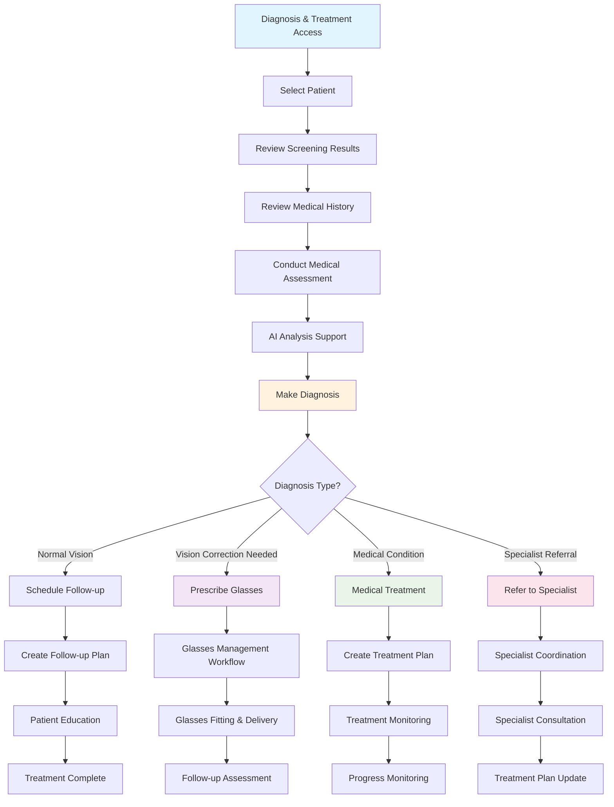
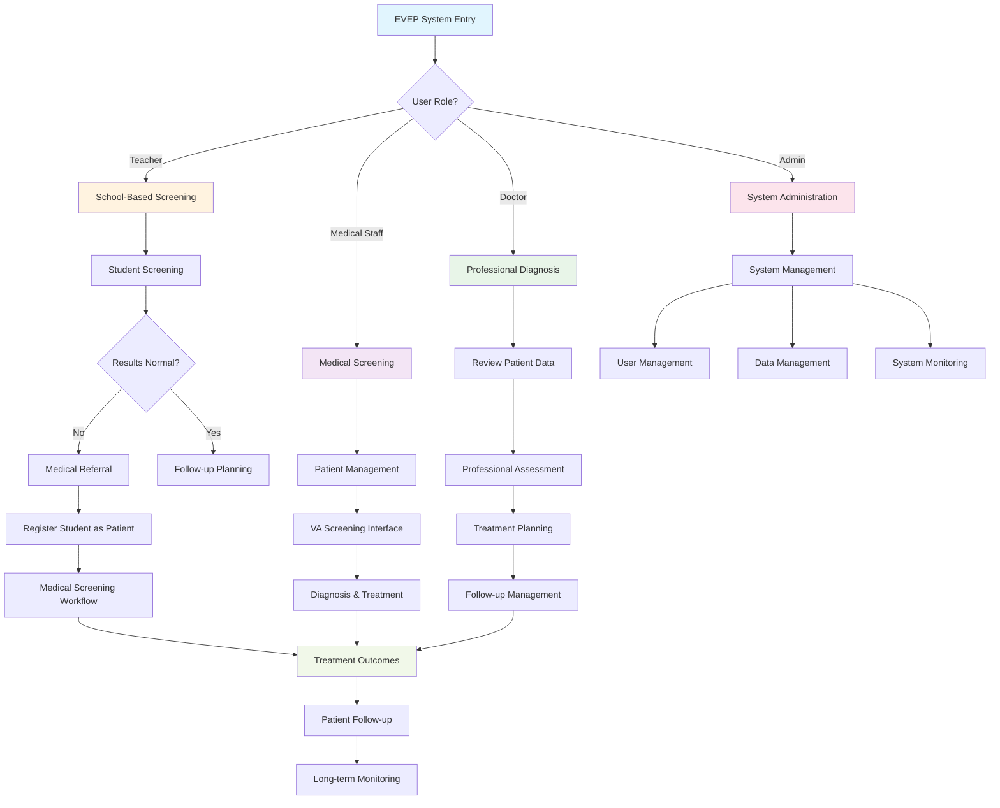

# EVEP Workflow Diagrams & Documentation

## 🔄 **System Workflow Overview**

### **Core Workflow Categories**
1. **School-Based Screening Workflow**
2. **Medical Screening Workflow**
3. **Patient Management Workflow**
4. **Treatment & Follow-up Workflow**
5. **Administrative Management Workflow**

---

## 🏫 **1. School-Based Screening Workflow**

### **Workflow Diagram**


### **Detailed Process Steps**

#### **Phase 1: School Screening Preparation**
1. **Teacher Authentication**
   - Teacher logs into EVEP Management portal
   - Access granted to school-specific student data
   - View class roster and previous screening history

2. **Student Selection**
   - Select students for screening session
   - Review previous screening results
   - Check parent consent status
   - Prepare screening environment

3. **Screening Session Setup**
   - Create new screening session
   - Select screening type (basic vision, color vision, etc.)
   - Record equipment used
   - Set session parameters

#### **Phase 2: Screening Execution**
4. **Conduct Screening**
   - Administer vision tests to students
   - Record results in real-time
   - Document any observations
   - Handle student breaks and accommodations

5. **Result Assessment**
   - Review screening results
   - Compare with age-appropriate standards
   - Identify students needing medical referral
   - Document screening outcomes

#### **Phase 3: Post-Screening Actions**
6. **Result Processing**
   - Normal results: Schedule follow-up
   - Abnormal results: Create medical referral
   - Update student screening history
   - Generate screening reports

7. **Communication**
   - Send results to parents via LINE
   - Notify medical staff of referrals
   - Update school records
   - Schedule follow-up appointments

---

## 🏥 **2. Medical Screening Workflow**

### **Workflow Diagram**


### **Detailed Process Steps**

#### **Phase 1: Patient Registration**
1. **Student-to-Patient Conversion**
   - Access "Register Student as Patient"
   - Select student from EVEP database
   - Review school screening results
   - Document registration reason and urgency
   - Link to referring teacher
   - Create patient record

2. **Direct Patient Registration**
   - Collect patient demographics
   - Record medical history
   - Obtain consent forms
   - Set up insurance information
   - Create patient profile

#### **Phase 2: Medical Screening**
3. **Screening Preparation**
   - Review patient history
   - Prepare screening equipment
   - Set up VA screening interface
   - Verify patient identity

4. **Professional Screening**
   - Conduct comprehensive vision tests
   - Record detailed results
   - Document observations
   - Perform additional tests as needed

#### **Phase 3: Diagnosis & Treatment**
5. **Result Analysis**
   - Review screening results
   - AI-powered analysis
   - Generate recommendations
   - Prepare diagnosis

6. **Treatment Planning**
   - Create treatment plan
   - Prescribe glasses if needed
   - Schedule follow-up appointments
   - Document medical decisions

---

## 👥 **3. Patient Management Workflow**

### **Workflow Diagram**


### **Detailed Process Steps**

#### **Phase 1: Patient Registration**
1. **Information Collection**
   - Personal demographics
   - Emergency contacts
   - Medical history
   - Family vision history
   - School information

2. **Documentation**
   - Consent forms
   - Insurance information
   - Previous medical records
   - Supporting documents

#### **Phase 2: Patient Management**
3. **Profile Management**
   - Update patient information
   - Track screening history
   - Monitor treatment progress
   - Manage appointments

4. **Communication**
   - Send appointment reminders
   - Share results with parents
   - Coordinate with schools
   - Handle inquiries

---

## 🔍 **4. Vision Screening Session Management Workflow**

### **Workflow Diagram**


### **Detailed Process Steps**

#### **Phase 1: Session Creation**
1. **Session Setup**
   - Create new screening session
   - Select patient from database
   - Choose screening type and equipment
   - Assign medical staff
   - Set session parameters

2. **Scheduling**
   - Set appointment time
   - Send notifications
   - Prepare equipment
   - Review patient history

#### **Phase 2: Session Execution**
3. **Patient Check-in**
   - Verify patient identity
   - Review consent status
   - Prepare screening environment
   - Update session status

4. **Screening Conduct**
   - Administer vision tests
   - Record results in real-time
   - Document observations
   - Handle interruptions

#### **Phase 3: Post-Session**
5. **Result Processing**
   - Review screening results
   - Generate reports
   - Update patient records
   - Determine next steps

6. **Follow-up Actions**
   - Schedule follow-up appointments
   - Create medical referrals if needed
   - Send results to parents
   - Update screening history

---

## 🩺 **5. Diagnosis & Treatment Workflow**

### **Workflow Diagram**


### **Detailed Process Steps**

#### **Phase 1: Assessment**
1. **Patient Review**
   - Review screening results
   - Examine medical history
   - Consider family history
   - Assess current symptoms

2. **Medical Evaluation**
   - Conduct comprehensive eye exam
   - Perform additional tests if needed
   - Document findings
   - Generate AI analysis

#### **Phase 2: Diagnosis**
3. **Diagnosis Formulation**
   - Analyze all available data
   - Consider differential diagnoses
   - Formulate final diagnosis
   - Document reasoning

4. **Treatment Planning**
   - Create treatment plan
   - Set treatment goals
   - Plan follow-up schedule
   - Document recommendations

#### **Phase 3: Treatment Implementation**
5. **Treatment Execution**
   - Prescribe glasses if needed
   - Initiate medical treatment
   - Coordinate with specialists
   - Monitor treatment progress

6. **Follow-up Management**
   - Schedule follow-up appointments
   - Monitor treatment effectiveness
   - Adjust treatment plans
   - Document outcomes

---

## 📊 **6. Complete EVEP System Workflow**

### **Master Workflow Diagram**


---

## 📋 **7. Role-Based Access Matrix**

| **Role** | **School Screening** | **Patient Registration** | **VA Screening** | **Diagnosis** | **Admin** |
|----------|---------------------|-------------------------|------------------|---------------|-----------|
| **Teacher** | ✅ Full Access | ❌ No Access | ❌ No Access | ❌ No Access | ❌ No Access |
| **Medical Staff** | ✅ View Only | ✅ Full Access | ✅ Basic Access | ❌ No Access | ❌ No Access |
| **Doctor** | ✅ View Only | ✅ Full Access | ✅ Full Access | ✅ Full Access | ❌ No Access |
| **Admin** | ✅ Full Access | ✅ Full Access | ✅ Full Access | ✅ Full Access | ✅ Full Access |

---

## 🔧 **8. Technical Implementation Details**

### **Component Architecture**
```
EVEP System
├── Frontend Components
│   ├── StudentToPatientRegistration.tsx
│   ├── VAScreeningInterface.tsx
│   ├── Screenings.tsx
│   └── DiagnosisTreatment.tsx
├── Backend APIs
│   ├── /api/v1/evep/students
│   ├── /api/v1/patients/registrations
│   ├── /api/v1/screenings/
│   └── /api/v1/va-screening/
└── Database Collections
    ├── students
    ├── patients
    ├── screenings
    └── va_screenings
```

### **Data Flow**
1. **School Data** → **Student Records** → **Patient Records**
2. **Screening Results** → **AI Analysis** → **Medical Recommendations**
3. **Patient Data** → **Treatment Plans** → **Follow-up Management**

---

## 📈 **9. Key Performance Indicators (KPIs)**

### **Screening Metrics**
- **Screening Completion Rate**: % of scheduled screenings completed
- **Referral Rate**: % of school screenings requiring medical referral
- **Treatment Compliance**: % of patients following treatment plans
- **Follow-up Attendance**: % of follow-up appointments attended

### **Quality Metrics**
- **Screening Accuracy**: Correlation between school and medical screening results
- **Treatment Effectiveness**: Improvement in vision after treatment
- **Patient Satisfaction**: Parent and patient satisfaction scores
- **System Uptime**: Platform availability and performance

---

## 🚀 **10. Future Enhancements**

### **Planned Features**
1. **AI-Powered Screening**: Automated vision assessment
2. **Mobile Screening App**: Portable screening capabilities
3. **Advanced Analytics**: Predictive analytics for vision health
4. **Integration APIs**: School management system integration
5. **Telemedicine**: Remote consultation capabilities

### **Scalability Considerations**
- **Multi-school Support**: Handle multiple school districts
- **Multi-language Support**: International deployment
- **Cloud Infrastructure**: Scalable cloud-based deployment
- **Data Analytics**: Advanced reporting and analytics

---

**Document Version**: 1.0  
**Last Updated**: August 30, 2025  
**Status**: ✅ **COMPLETE**
