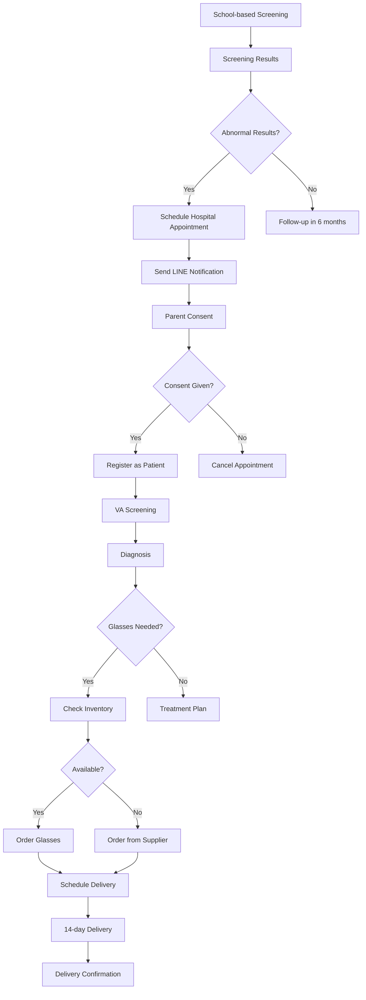

# EVEP Workflow Implementation Plan

## 🎯 **Workflow Overview**

### **🏫 School-based Screening Management Workflow**
```
Teacher Login → Select Student → Screening → Save Outcome
```

### **🏥 Hospital (Mobile Unit) Screening Workflow**
```
Hospital Staff Schedule → Teacher Notify Parents → Parents Consent → 
Medical Staff Register Student → VA Screening → Glasses Selection → 
Inventory Check → 14-day Delivery
```

## 📋 **Implementation Plan**

### **Phase 1: Enhanced School-based Screening (Week 1-2)**

#### **1.1 Teacher-Student Relationship Management**
```yaml
Database Collections:
  - teacher_students: Links teachers to their assigned students
  - school_teachers: Links schools to their teachers
  - parent_students: Links parents to their children

API Endpoints:
  - GET /api/v1/evep/teachers/{teacher_id}/students
  - POST /api/v1/evep/teachers/{teacher_id}/students/{student_id}
  - DELETE /api/v1/evep/teachers/{teacher_id}/students/{student_id}
  - GET /api/v1/evep/schools/{school_id}/teachers
  - GET /api/v1/evep/parents/{parent_id}/students

Frontend Components:
  - TeacherStudentAssignment.tsx
  - StudentSelectionDropdown.tsx
  - ParentStudentRelationship.tsx
```

#### **1.2 Enhanced Screening Outcome Management**
```yaml
Database Schema Updates:
  - screenings collection: Add outcome_details, recommendations, follow_up_date
  - screening_outcomes: New collection for detailed outcomes

API Endpoints:
  - POST /api/v1/screenings/sessions/{session_id}/outcome
  - GET /api/v1/screenings/sessions/{session_id}/outcome
  - PUT /api/v1/screenings/sessions/{session_id}/outcome

Frontend Components:
  - ScreeningOutcomeForm.tsx
  - OutcomeSummary.tsx
  - FollowUpScheduler.tsx
```

### **Phase 2: Hospital Mobile Unit Workflow (Week 3-4)**

#### **2.1 Appointment Scheduling System**
```yaml
Database Collections:
  - appointments: Hospital screening appointments
  - appointment_schedules: Available time slots
  - school_appointments: School-specific appointment blocks

API Endpoints:
  - POST /api/v1/appointments
  - GET /api/v1/appointments/school/{school_id}
  - PUT /api/v1/appointments/{appointment_id}
  - DELETE /api/v1/appointments/{appointment_id}
  - GET /api/v1/appointments/available-slots

Frontend Components:
  - AppointmentScheduler.tsx
  - SchoolAppointmentCalendar.tsx
  - AppointmentConfirmation.tsx
```

#### **2.2 LINE Bot Integration for Parent Communication**
```yaml
Database Collections:
  - line_notifications: LINE bot message history
  - consent_requests: Parent consent tracking
  - notification_templates: Message templates

API Endpoints:
  - POST /api/v1/notifications/line/send-consent
  - POST /api/v1/notifications/line/send-reminder
  - GET /api/v1/notifications/line/status/{message_id}
  - POST /api/v1/consent/request
  - PUT /api/v1/consent/{consent_id}/response

Frontend Components:
  - LineNotificationManager.tsx
  - ConsentRequestForm.tsx
  - NotificationTemplateEditor.tsx
```

#### **2.3 Consent Management System**
```yaml
Database Collections:
  - consent_forms: Consent form templates
  - consent_responses: Parent consent responses
  - consent_history: Consent tracking over time

API Endpoints:
  - POST /api/v1/consent/forms
  - GET /api/v1/consent/forms/{form_id}
  - POST /api/v1/consent/responses
  - GET /api/v1/consent/student/{student_id}/status

Frontend Components:
  - ConsentFormBuilder.tsx
  - ConsentResponseViewer.tsx
  - ConsentStatusTracker.tsx
```

### **Phase 3: Medical Screening Workflow (Week 5-6)**

#### **3.1 Patient Registration from Students**
```yaml
Database Collections:
  - student_patient_mapping: Links students to patients
  - patient_registration_logs: Registration tracking

API Endpoints:
  - POST /api/v1/patients/register-from-student
  - GET /api/v1/patients/student/{student_id}
  - PUT /api/v1/patients/{patient_id}/student-link

Frontend Components:
  - StudentToPatientRegistration.tsx
  - PatientRegistrationForm.tsx
  - RegistrationConfirmation.tsx
```

#### **3.2 VA Screening and Diagnosis Flow**
```yaml
Database Collections:
  - va_screenings: Visual acuity screening results
  - diagnoses: Medical diagnoses
  - treatment_plans: Treatment recommendations

API Endpoints:
  - POST /api/v1/screenings/va
  - GET /api/v1/screenings/va/{screening_id}
  - POST /api/v1/diagnoses
  - GET /api/v1/diagnoses/patient/{patient_id}
  - POST /api/v1/treatments/plans

Frontend Components:
  - VAScreeningInterface.tsx
  - DiagnosisForm.tsx
  - TreatmentPlanBuilder.tsx
```

### **Phase 4: Glasses Management (Week 7-8)**

#### **4.1 Glasses Inventory Management**
```yaml
Database Collections:
  - glasses_inventory: Available glasses stock
  - glasses_orders: Glasses orders
  - glasses_deliveries: Delivery tracking

API Endpoints:
  - GET /api/v1/inventory/glasses
  - POST /api/v1/inventory/glasses/order
  - PUT /api/v1/inventory/glasses/{item_id}
  - GET /api/v1/inventory/glasses/available

Frontend Components:
  - GlassesInventoryManager.tsx
  - GlassesOrderForm.tsx
  - InventoryDashboard.tsx
```

#### **4.2 Delivery Management System**
```yaml
Database Collections:
  - deliveries: Delivery tracking
  - delivery_schedules: Delivery scheduling
  - delivery_confirmations: Delivery confirmations

API Endpoints:
  - POST /api/v1/deliveries
  - GET /api/v1/deliveries/school/{school_id}
  - PUT /api/v1/deliveries/{delivery_id}/status
  - POST /api/v1/deliveries/{delivery_id}/confirm

Frontend Components:
  - DeliveryScheduler.tsx
  - DeliveryTracker.tsx
  - DeliveryConfirmation.tsx
```

## 🔧 **Technical Implementation Details**

### **Database Schema Updates**

#### **New Collections**
```javascript
// Teacher-Student Relationships
teacher_students: {
  _id: ObjectId,
  teacher_id: ObjectId,
  student_id: ObjectId,
  school_id: ObjectId,
  assigned_date: Date,
  status: String, // active, inactive
  created_at: Date,
  updated_at: Date
}

// Appointments
appointments: {
  _id: ObjectId,
  school_id: ObjectId,
  hospital_staff_id: ObjectId,
  appointment_date: Date,
  start_time: String,
  end_time: String,
  status: String, // scheduled, confirmed, completed, cancelled
  notes: String,
  created_at: Date,
  updated_at: Date
}

// Consent Management
consent_requests: {
  _id: ObjectId,
  student_id: ObjectId,
  parent_id: ObjectId,
  appointment_id: ObjectId,
  consent_type: String, // screening, treatment, data_sharing
  status: String, // pending, approved, declined
  response_date: Date,
  response_notes: String,
  created_at: Date,
  updated_at: Date
}

// Glasses Inventory
glasses_inventory: {
  _id: ObjectId,
  model: String,
  prescription_range: {
    min_sphere: Number,
    max_sphere: Number,
    min_cylinder: Number,
    max_cylinder: Number
  },
  frame_size: String, // small, medium, large
  color: String,
  quantity: Number,
  unit_price: Number,
  supplier: String,
  created_at: Date,
  updated_at: Date
}

// Deliveries
deliveries: {
  _id: ObjectId,
  patient_id: ObjectId,
  glasses_order_id: ObjectId,
  school_id: ObjectId,
  delivery_date: Date,
  status: String, // scheduled, in_transit, delivered, confirmed
  delivery_notes: String,
  confirmed_by: ObjectId,
  confirmed_at: Date,
  created_at: Date,
  updated_at: Date
}
```

### **API Endpoint Specifications**

#### **Appointment Management**
```python
@router.post("/appointments")
async def create_appointment(
    appointment_data: AppointmentCreate,
    current_user: dict = Depends(get_current_user)
):
    """Create a new hospital screening appointment"""
    # Only hospital staff can create appointments
    if current_user["role"] not in ["medical_staff", "doctor", "admin"]:
        raise HTTPException(status_code=403, detail="Insufficient permissions")
    
    # Validate school exists
    # Check for conflicts
    # Create appointment
    # Send notifications to school

@router.get("/appointments/school/{school_id}")
async def get_school_appointments(
    school_id: str,
    current_user: dict = Depends(get_current_user)
):
    """Get all appointments for a specific school"""
    # Validate user has access to school data
    # Return appointments with filtering options
```

#### **LINE Bot Integration**
```python
@router.post("/notifications/line/send-consent")
async def send_consent_notification(
    consent_data: ConsentNotificationCreate,
    current_user: dict = Depends(get_current_user)
):
    """Send consent request via LINE Bot"""
    # Validate parent has LINE ID
    # Create consent request record
    # Send LINE message
    # Track message status
```

#### **Glasses Inventory**
```python
@router.post("/inventory/glasses/order")
async def order_glasses(
    order_data: GlassesOrderCreate,
    current_user: dict = Depends(get_current_user)
):
    """Order glasses for a patient"""
    # Check inventory availability
    # Create order
    # Update inventory
    # Schedule delivery
```

### **Frontend Component Architecture**

#### **Appointment Scheduling**
```typescript
// AppointmentScheduler.tsx
interface AppointmentSchedulerProps {
  schoolId: string;
  onAppointmentCreated: (appointment: Appointment) => void;
}

const AppointmentScheduler: React.FC<AppointmentSchedulerProps> = ({
  schoolId,
  onAppointmentCreated
}) => {
  const [selectedDate, setSelectedDate] = useState<Date | null>(null);
  const [availableSlots, setAvailableSlots] = useState<TimeSlot[]>([]);
  const [selectedSlot, setSelectedSlot] = useState<TimeSlot | null>(null);
  
  // Component implementation
};
```

#### **LINE Notification Manager**
```typescript
// LineNotificationManager.tsx
interface LineNotificationManagerProps {
  studentId: string;
  parentId: string;
  appointmentId: string;
}

const LineNotificationManager: React.FC<LineNotificationManagerProps> = ({
  studentId,
  parentId,
  appointmentId
}) => {
  const [notificationStatus, setNotificationStatus] = useState<string>('');
  const [consentStatus, setConsentStatus] = useState<string>('');
  
  // Component implementation
};
```

## 📊 **Workflow Integration Points**

### **Data Flow Between Workflows**


## 🚀 **Implementation Timeline**

### **Week 1-2: Enhanced School-based Screening**
- [ ] Teacher-Student relationship management
- [ ] Enhanced screening outcome management
- [ ] Parent-Student relationship tracking

### **Week 3-4: Hospital Mobile Unit Foundation**
- [ ] Appointment scheduling system
- [ ] LINE Bot integration setup
- [ ] Consent management system

### **Week 5-6: Medical Screening Workflow**
- [ ] Patient registration from students
- [ ] VA screening interface
- [ ] Diagnosis and treatment planning

### **Week 7-8: Glasses Management**
- [ ] Glasses inventory management
- [ ] Delivery scheduling system
- [ ] Complete workflow integration

## 🎯 **Success Criteria**

### **Functional Requirements**
- [ ] Teachers can assign students and conduct screenings
- [ ] Hospital staff can schedule appointments
- [ ] Parents receive LINE notifications and can give consent
- [ ] Students can be registered as patients
- [ ] VA screening and diagnosis workflow is complete
- [ ] Glasses inventory and delivery is managed
- [ ] All workflows are integrated and functional

### **Technical Requirements**
- [ ] All API endpoints are documented and tested
- [ ] Frontend components are responsive and accessible
- [ ] Database queries are optimized
- [ ] Error handling is comprehensive
- [ ] Security measures are implemented
- [ ] Performance meets requirements

### **User Experience Requirements**
- [ ] Workflows are intuitive and easy to follow
- [ ] Notifications are timely and clear
- [ ] Data is consistent across all modules
- [ ] Users can track progress at each step
- [ ] System provides clear feedback and guidance
