# EVEP Workflows & Business Processes

## 🔄 **System Workflows Overview**

### **Core Workflow Categories**
1. **User Management Workflows**
2. **Patient Management Workflows**
3. **Screening Workflows**
4. **AI/ML Analysis Workflows**
5. **Communication Workflows**
6. **Reporting & Analytics Workflows**
7. **Administrative Workflows**

## 👥 **User Management Workflows**

### **1. User Registration & Onboarding**
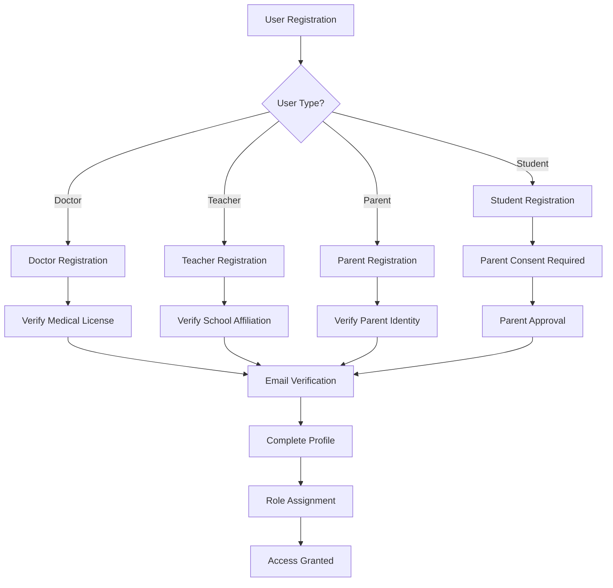

#### **Workflow Steps**
1. **Registration Initiation**
   - User selects role and registration type
   - System validates role-specific requirements
   - User provides basic information

2. **Identity Verification**
   - **Doctors**: Medical license verification
   - **Teachers**: School affiliation verification
   - **Parents**: Identity verification
   - **Students**: Parent consent required

3. **Profile Completion**
   - Complete personal information
   - Set up preferences and notifications
   - Upload required documents

4. **Access Activation**
   - Email verification
   - Role-based permissions assigned
   - Welcome onboarding process

### **2. Authentication & Security**
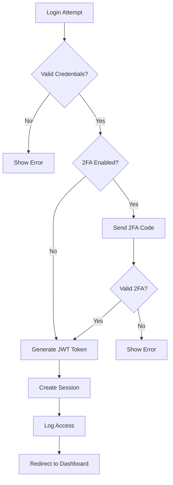

#### **Security Measures**
- **JWT Token Management**: 24-hour expiration with refresh
- **Blockchain Audit Trail**: All authentication events logged
- **Rate Limiting**: Prevent brute force attacks
- **Session Management**: Secure session handling
- **Hourly Audit Reports**: Telegram notifications for security events

## 🏥 **Patient Management Workflows**

### **3. Patient Registration**
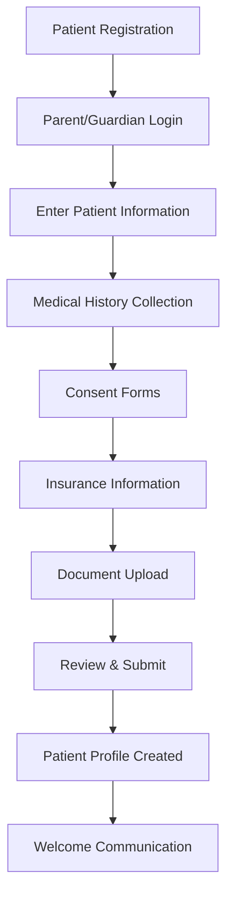

#### **Registration Process**
1. **Parent/Guardian Authentication**
   - Verify parent identity
   - Check existing patient records
   - Validate contact information

2. **Patient Information Collection**
   - Personal demographics
   - Emergency contacts
   - Medical history
   - Family vision history

3. **Consent Management**
   - Informed consent for screening
   - Data sharing permissions
   - Treatment authorization
   - Emergency procedures consent

4. **Document Management**
   - Medical records upload
   - Insurance information
   - Previous screening results
   - Supporting documents

### **4. Patient Screening Workflow**
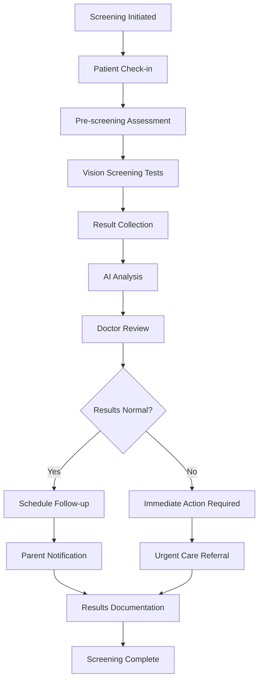

#### **Screening Process**
1. **Pre-screening Setup**
   - Patient identification
   - Equipment calibration
   - Environment preparation
   - Consent verification

2. **Screening Execution**
   - Multiple test types (Snellen, Tumbling E, Lea Symbols)
   - Real-time result tracking
   - Quality assurance checks
   - Break management for children

3. **Result Processing**
   - Automated result analysis
   - AI-powered insights
   - Risk assessment
   - Recommendation generation

4. **Post-screening Actions**
   - Doctor review and validation
   - Treatment planning
   - Follow-up scheduling
   - Parent communication

## 🤖 **AI/ML Analysis Workflows**

### **5. AI Insight Generation**
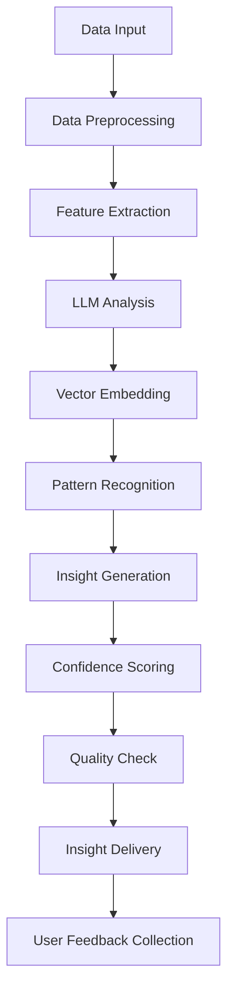

#### **AI Analysis Process**
1. **Data Collection**
   - Screening results
   - Medical history
   - Academic performance
   - Previous insights

2. **Analysis Pipeline**
   - Data preprocessing and cleaning
   - Feature extraction and engineering
   - LLM prompt generation
   - Vector similarity search

3. **Insight Generation**
   - Pattern recognition
   - Risk assessment
   - Recommendation generation
   - Confidence scoring

4. **Quality Assurance**
   - Model validation
   - Clinical review
   - Bias detection
   - Performance monitoring

### **6. Role-Based AI Insights**
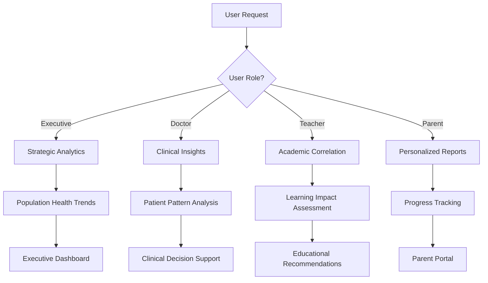

## 📱 **Communication Workflows**

### **7. Notification System**
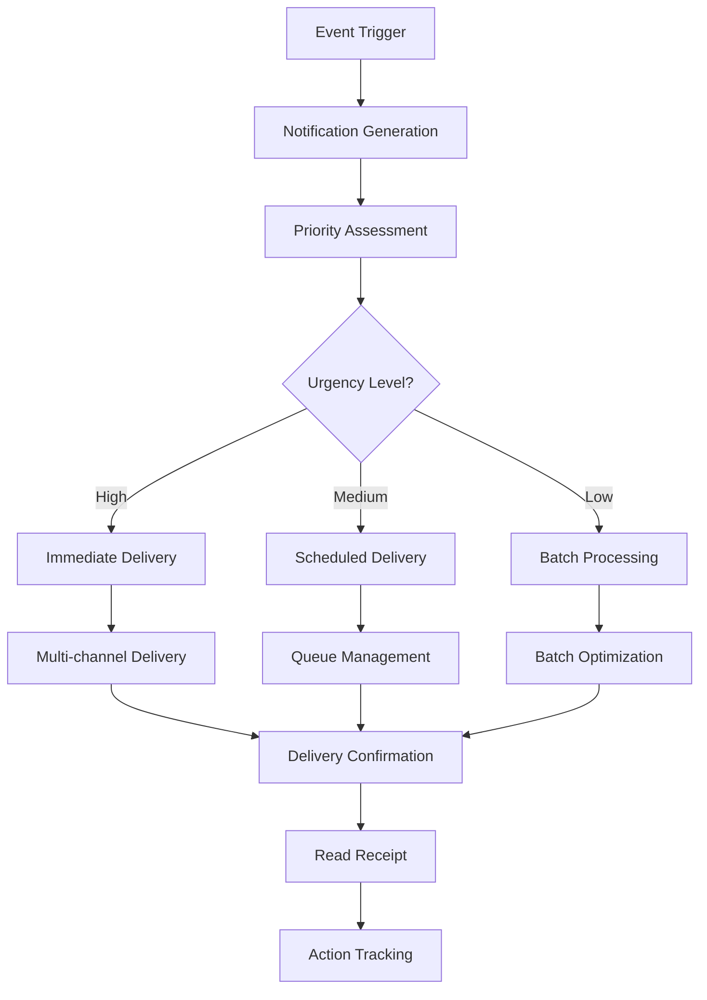

#### **Communication Channels**
- **Email**: Detailed reports and notifications
- **SMS**: Urgent alerts and reminders
- **LINE**: Interactive communication and updates
- **In-app**: Real-time notifications and alerts
- **Push Notifications**: Mobile app notifications

### **8. LINE Bot Workflow**
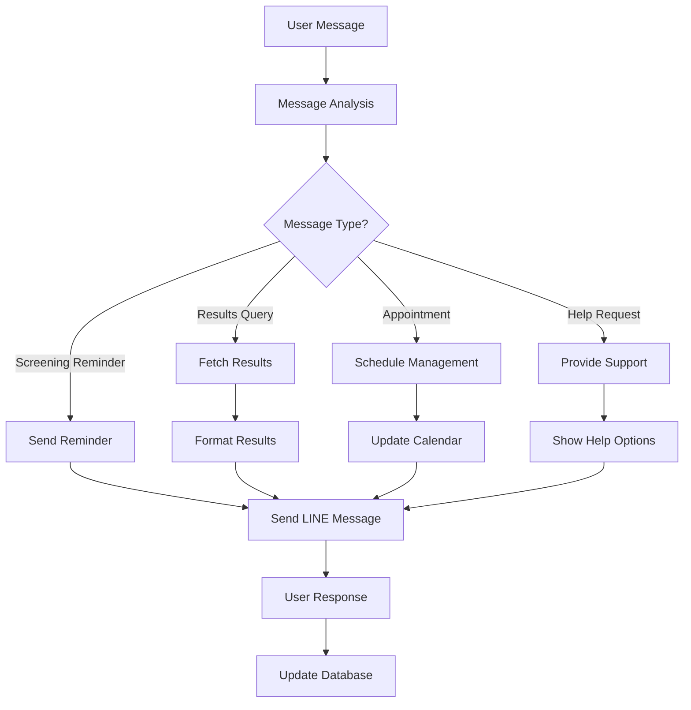

## 📊 **Reporting & Analytics Workflows**

### **9. Report Generation**
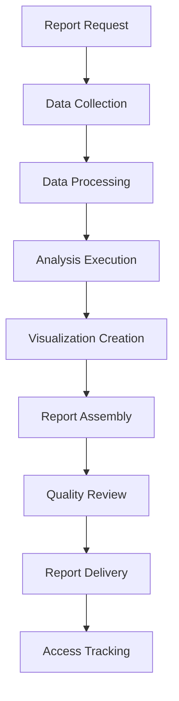

#### **Report Types**
1. **Individual Patient Reports**
   - Screening history
   - Progress tracking
   - Treatment recommendations
   - Academic impact

2. **School Reports**
   - Class-level analytics
   - Screening coverage
   - Academic correlation
   - Intervention effectiveness

3. **Population Health Reports**
   - Regional trends
   - Risk factor analysis
   - Resource allocation
   - Policy recommendations

4. **Executive Dashboards**
   - Key performance indicators
   - Strategic insights
   - ROI analysis
   - Market trends

### **10. Data Export Workflow**
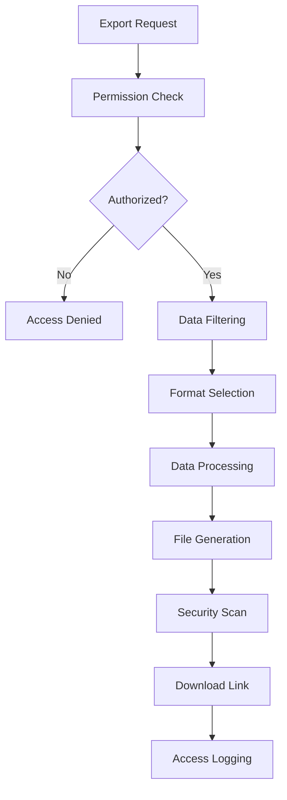

## ⚙️ **Administrative Workflows**

### **11. System Administration**
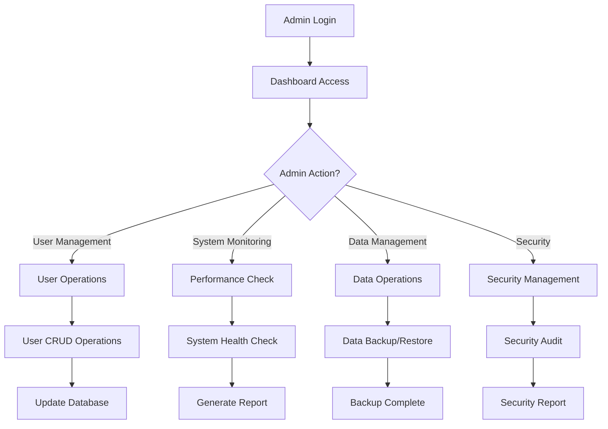

### **12. Compliance & Audit Workflow**
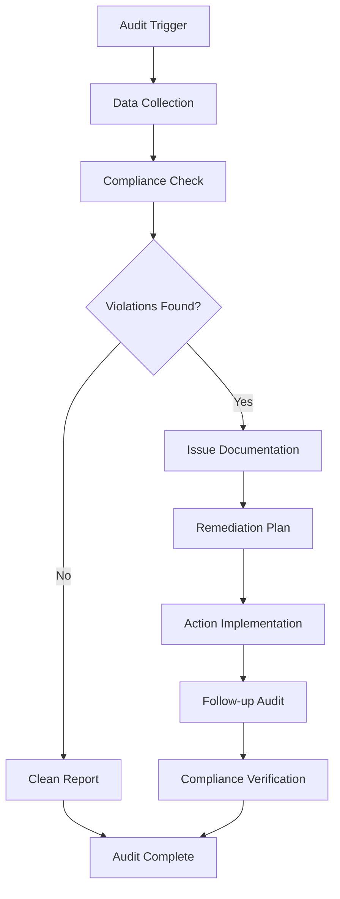

## 🔄 **Integration Workflows**

### **13. School System Integration**
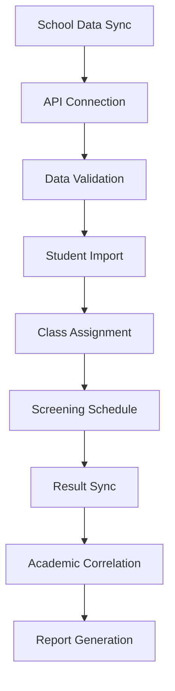

### **14. Third-party Service Integration**
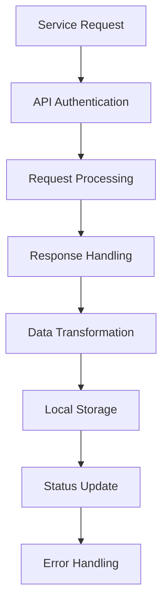

## 📋 **Workflow Management**

### **Workflow Configuration**
```yaml
Workflow Settings:
  - Auto-approval thresholds
  - Escalation rules
  - Notification preferences
  - SLA definitions
  - Error handling procedures
```

### **Workflow Monitoring**
```yaml
Monitoring Metrics:
  - Workflow completion rates
  - Processing times
  - Error rates
  - User satisfaction
  - System performance
```

### **Workflow Optimization**
```yaml
Optimization Strategies:
  - Process automation
  - Bottleneck identification
  - Performance tuning
  - User experience improvement
  - Cost optimization
```

## 🎯 **Workflow Success Criteria**

### **Performance Metrics**
- **Response Time**: < 2 seconds for user interactions
- **Processing Time**: < 30 seconds for AI analysis
- **Accuracy**: > 95% for screening results
- **Uptime**: 99.9% system availability
- **User Satisfaction**: > 4.5/5 rating

### **Quality Assurance**
- **Data Integrity**: 100% data consistency
- **Security Compliance**: Zero security breaches
- **Audit Trail**: Complete activity logging
- **Error Handling**: Graceful error recovery
- **User Training**: Comprehensive user education

This comprehensive workflow documentation provides a detailed understanding of all business processes and system interactions within the EVEP platform.
